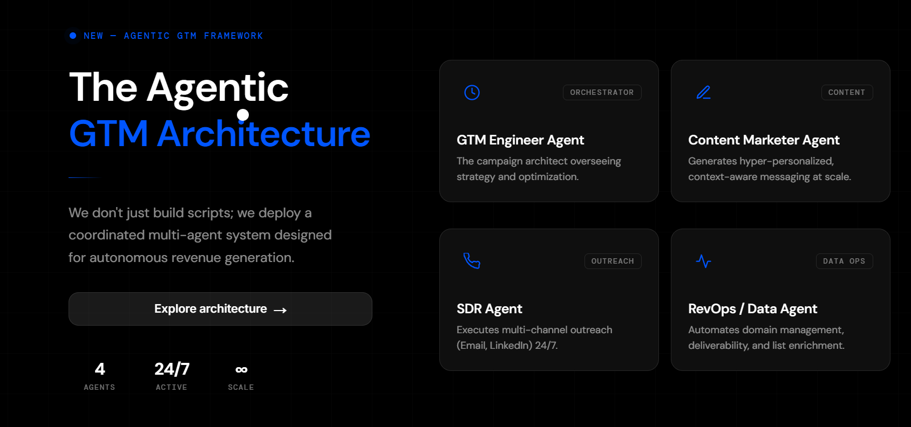
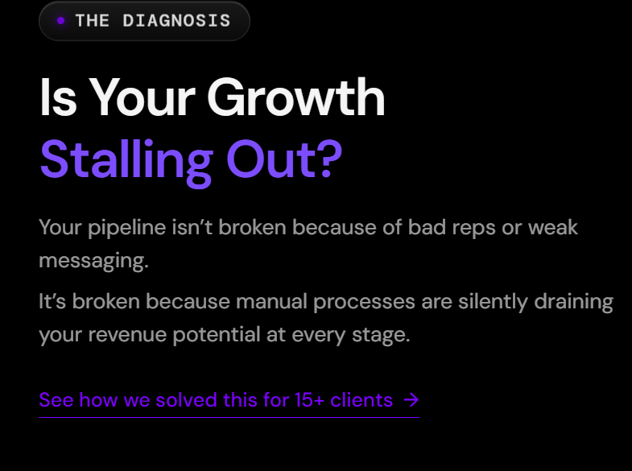
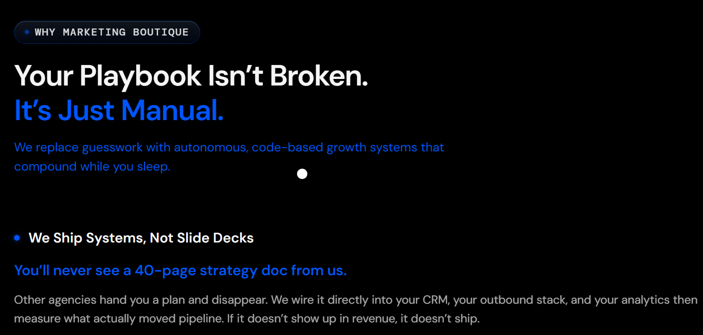
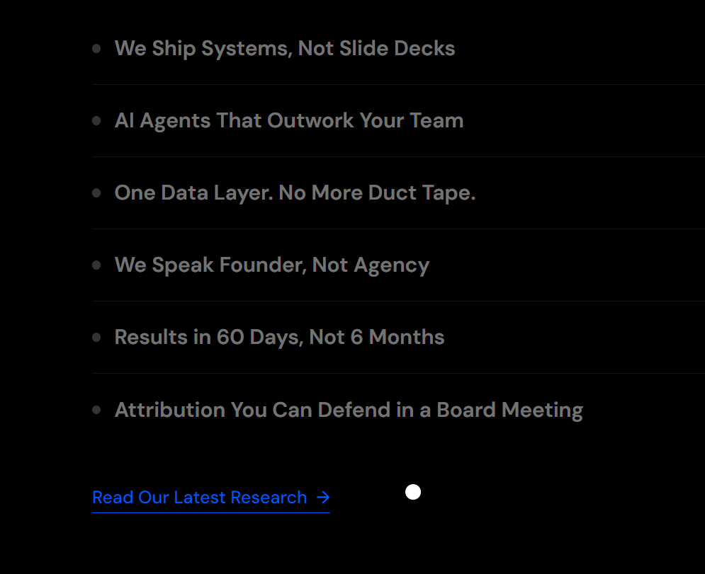
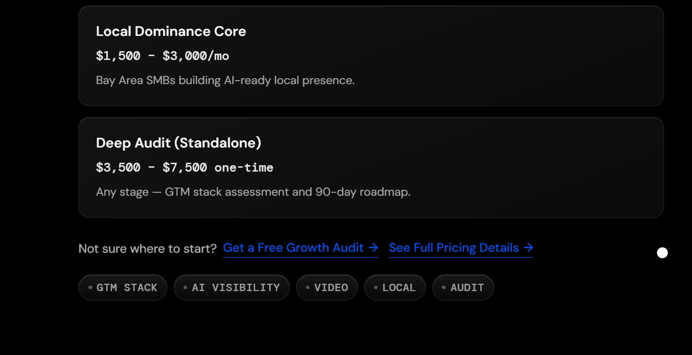
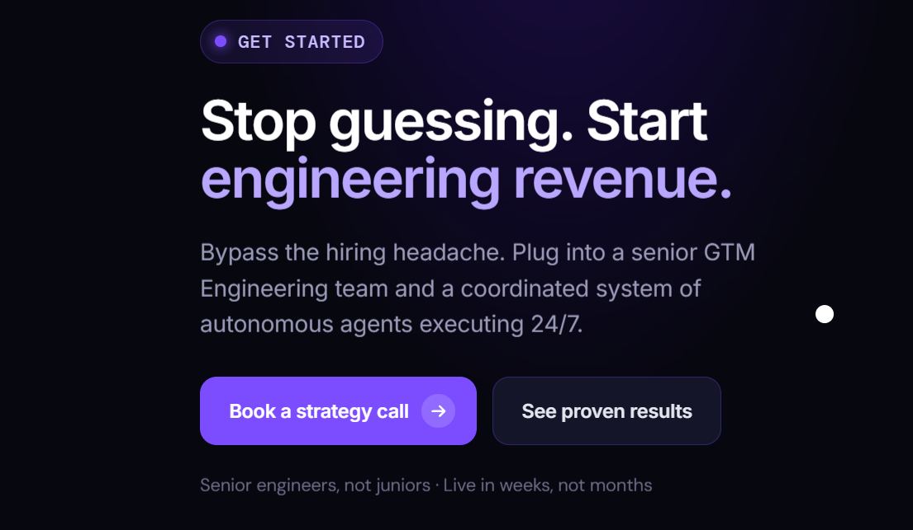
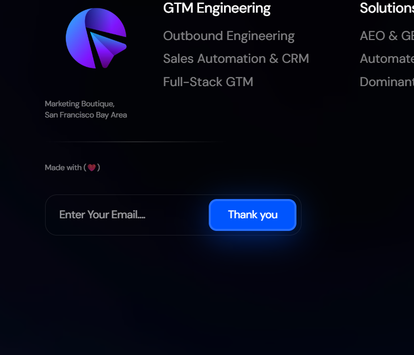

# Website Audit Report

This document lists all issues identified during the website audit, with a screenshot for each.

> **Note:** Upload your screenshots to an `images/` folder in this repo, then replace the placeholder filenames below (e.g. `issue-1-flickering.png`) with your actual image filenames.

---

### 1. Flickering of the site
The site flickers while scrolling down. The issue does not occur when the tab is not in fullscreen mode.

---

### 2. Duplicate Heading Content
The homepage shows "GTM Engineering Agency" followed by "for B2B AI Startups" appearing twice in the page content.

---

### 3. Broken / Incorrect External Link
The "Explore architecture →" link points to example.com instead of a relevant Marketing Boutique page.

 

---

### 4. Link is Not Opening
The "See how we solved this for 15+ clients" link does not redirect anywhere.

---

### 5. Hidden Interactive Options (No Visual Cue)
Clicking "We Ship Systems, Not Slide Decks" reveals multiple options, but there's no visual indication beforehand that it's clickable or contains options.

---

### 6. Not Redirecting After Click
"Read Our Latest Research" does not redirect after being clicked.

---

### 7. Not Redirecting After Click
"Get a free growth audit" and "See full pricing details" do not open after being clicked.

---

### 8. Not Redirecting After Click
"Book a strategy call" and "See Proven results" do not redirect after being clicked.

---

### 9. Form Validation Missing
Clicking "Subscribe" without entering an email still shows a "Thank you" confirmation message.

---

### 10. Not Redirecting
The Privacy Policy and Terms and Conditions links do not open.

---

*Compiled from manual QA/SEO audit findings.*
